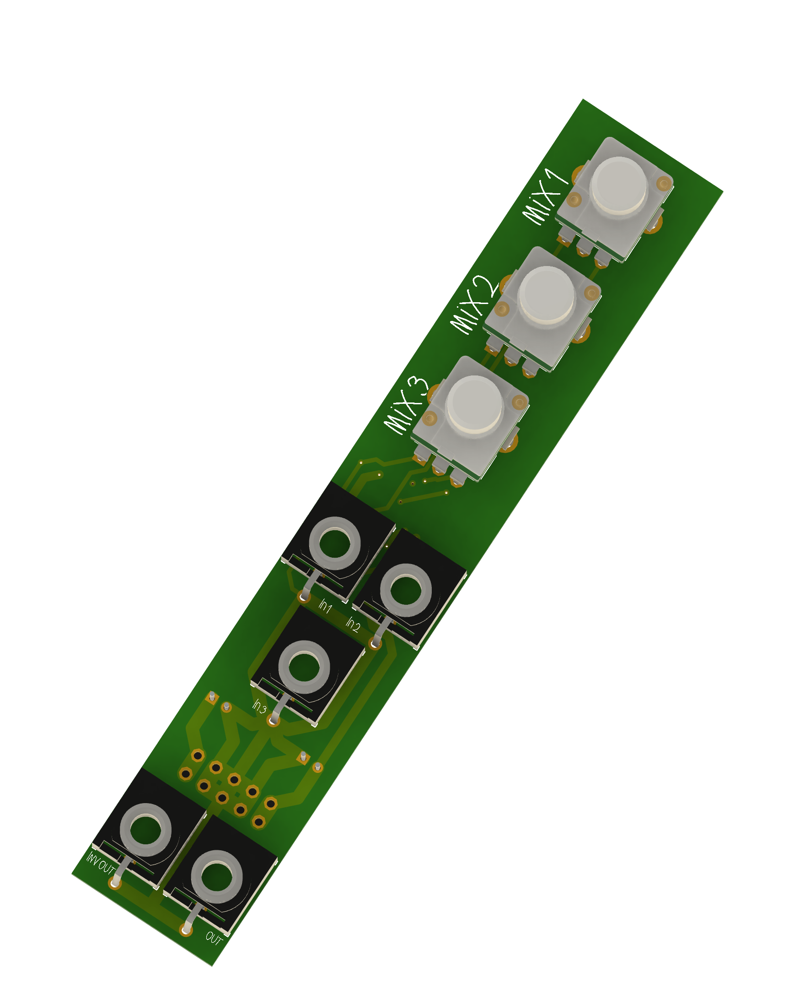

# Mixer

Here's a very simple mixer 

| Part | Quantity |
|----------|----------|
| [Thonkiconn](https://www.thonk.co.uk/shop/thonkiconn/) | 6 |
| [100k Log Potentiometer](https://www.taydaelectronics.com/100k-ohm-logarithmic-taper-potentiometer-round-shaft-pcb-9mm.html) | 3 |

