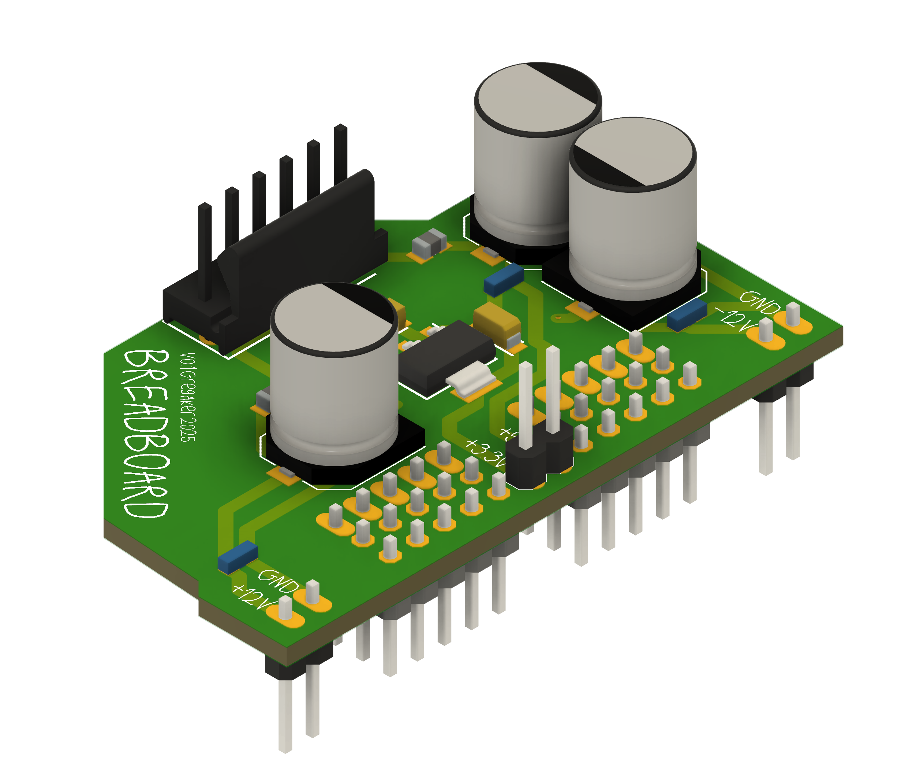

# Breadboard

Simple breadboard adapter for a Meanwell RT65B.

* Provides power filtering to save space on the breadboard.
* +12V/GND / -12V/GND rails to fit on either side of the breadboard.
* Pin header for +3.3v & 5V

Uses a ``TE-Connectivity-AMP/640456-6`` connector to supply power to the board.  Sorry in advance. I have a crimper that can make these cables. If anyone wants a board with something different, I can make one if you wish.

| Pin | Usage |
|-----|-------|
| 1   | +5V   |
| 2   | GND   |
| 3   | NC    |
| 4   | +12V  |
| 5   | NC    |
| 6   | -12V  |

## Cost

Manufactured at [JLCPCB](https://www.jlcpcb.com) in July of 2025 with PCBA assembly (see Production directory for more info).

*PCBA for 5 boards*

| Item                    | Cost       |
|-------------------------|------------|
| Merchandise Total       | $15.75     |
| Shipping Charge         | $37.39     |
| Customs duties & taxes  | $8.67      |
| Sales Tax               | $4.25      |
| **Order Total**         | **$66.06** | 

## Safety with the power supply

Your mileage may vary, and do this at your own risk, k?  This power supply is a bit scary for desk usage since the line-level voltages can easily be touched. That could mean a very bad day for you and your loved ones.  I wired up a line cord and then used hot glue to cover the terminals taking extra care to test continuity everywhere to ensure this doesn't shock me by being on my benchtop.  I also keep it in a little box I drilled holes into. 

But you do you. Whatever you think makes sense. 
